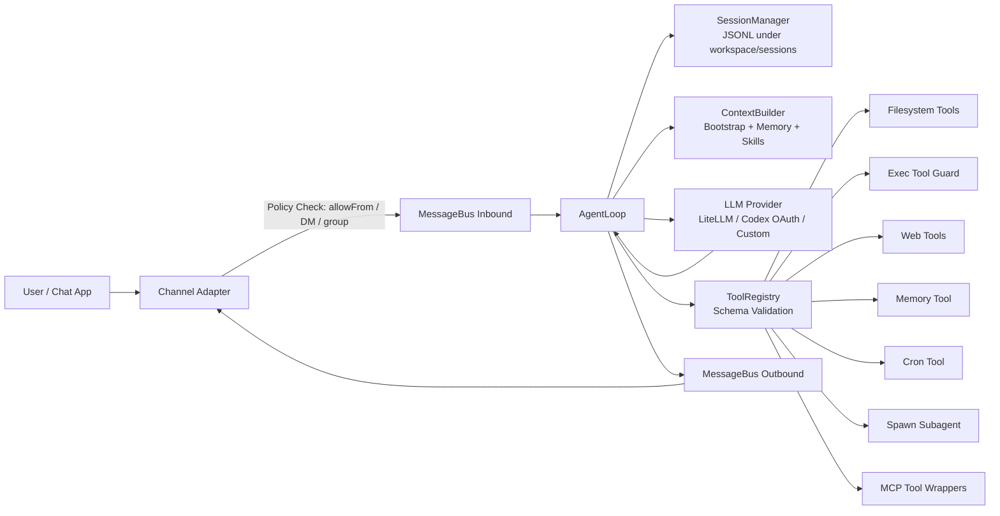

<div align="center">
  <h1>neobot: Security Personal AI Bot</h1>
</div>

> neobot is a security-oriented deployment profile built on the nanobot core.

neobot is designed for people who want an autonomous personal bot with practical security controls by default-aware design:

- Channel-side access control (`allowFrom`, DM/group policy)
- Workspace-level tool sandbox (`tools.restrictToWorkspace`)
- Guarded shell execution (dangerous pattern blocking + path checks)
- Tool parameter schema validation before execution
- Email explicit consent gate (`channels.email.consentGranted`)
- WhatsApp bridge localhost binding + optional shared token authentication

## 📢 Why neobot

Most personal agents optimize for convenience first. neobot optimizes for **safe autonomy under real-world usage**:

- **Security-first operations**: architecture explicitly separates ingress control, policy checks, tool runtime, and egress delivery.
- **Composable controls**: security settings are centralized in config and mapped to runtime behavior.
- **Production realism**: includes cron, heartbeat, multi-channel gateway, MCP integration, and OAuth providers.
- **Readable core**: small codebase, easy for security review and extension.

## 🛡️ Security At A Glance

| Layer | Built-in Control | Practical Effect |
|------|------------------|------------------|
| Channel ingress | `allowFrom` / channel policy checks | Unknown senders can be blocked before entering agent loop |
| Agent runtime | Per-session queues + isolated session history | Reduces cross-session context confusion |
| Tool invocation | JSON-schema parameter validation | Invalid/malformed tool calls are rejected |
| File tools | Workspace restriction + resolved path checks | Prevents out-of-scope file access when sandbox is enabled |
| Shell tool | Denylist + traversal/outside-dir guard + timeout | Reduces risk of destructive commands |
| Web fetch | URL scheme/domain validation + redirect cap | Blocks non-http(s) and malformed URLs |
| Email | Consent gate + sender allowlist + optional auto-reply off | Explicit mailbox access control |
| WhatsApp bridge | `127.0.0.1` bind + optional token handshake | Prevents unauthenticated remote bridge access |
| MCP | Explicit server config + namespaced tool registration | Remote capabilities stay auditable and scoped by config |

## 🏗️ Architecture

<p align="center">
  
</p>



## 🔄 Runtime Flow (Security View)

1. **Ingress**: channel receives message and applies sender policy checks.
2. **Routing**: message enters `MessageBus` inbound queue.
3. **Session isolation**: `AgentLoop` resolves `channel:chat_id` and loads dedicated session history.
4. **Context build**: system prompt is assembled from bootstrap files, memory, and skills.
5. **Model call**: provider selected by model/provider registry.
6. **Tool calls**: each call goes through registry parameter validation.
7. **Guardrails**: filesystem/shell/web tools enforce their own runtime constraints.
8. **Persistence**: user/assistant/tool traces are written to session JSONL.
9. **Egress**: outbound message is dispatched back to target channel.

## ✨ Core Capabilities

- Multi-channel chat gateway (Telegram, Discord, WhatsApp, Feishu, Mochat, DingTalk, Slack, Email, QQ)
- Tool-enabled autonomous execution (file, shell, web, memory, cron, subagent, MCP)
- Session persistence and long-term memory
- Scheduled tasks (`cron`) and periodic wake-up (`heartbeat`)
- OAuth provider login for OpenAI Codex and GitHub Copilot

## 📦 Install

**Install from source** (development / latest)

```bash
git clone https://github.com/HKUDS/nanobot.git
cd nanobot
pip install -e .
```

**Install with uv**

```bash
uv tool install nanobot-ai
```

**Install from PyPI**

```bash
pip install nanobot-ai
```

## 🚀 Quick Start (Hardened)

**1. Initialize**

```bash
nanobot onboard
```

**2. Apply a secure baseline config** (`~/.nanobot/config.json`)

```json
{
  "agents": {
    "defaults": {
      "model": "anthropic/claude-opus-4-5"
    }
  },
  "providers": {
    "openrouter": {
      "apiKey": "sk-or-v1-xxx"
    }
  },
  "tools": {
    "restrictToWorkspace": true,
    "exec": {
      "timeout": 120
    }
  },
  "channels": {
    "telegram": {
      "enabled": true,
      "token": "YOUR_BOT_TOKEN",
      "allowFrom": ["YOUR_USER_ID"]
    }
  }
}
```

**3. Start chat / gateway**

```bash
nanobot agent
# or
nanobot gateway
```

**4. Verify status**

```bash
nanobot status
nanobot channels status
```

## 🔐 Production Baseline Checklist

- Set `tools.restrictToWorkspace` to `true`
- Configure `allowFrom` for every enabled channel
- Keep `channels.email.consentGranted` as `false` unless explicitly approved
- Use dedicated API keys with spending limits
- Run as non-root user
- Protect `~/.nanobot/config.json` permissions (e.g. `0600`)
- Review logs and rotate credentials regularly

## 💬 Chat Channels

| Channel | Transport | Main Security Controls |
|--------|-----------|------------------------|
| Telegram | Long polling | `allowFrom` (user id/username) |
| Discord | Gateway WebSocket | `allowFrom` |
| WhatsApp | Local Node bridge | `allowFrom`, `bridgeToken`, localhost-only bridge bind |
| Feishu | WebSocket long connection | `allowFrom` |
| Mochat | Socket.IO + polling fallback | `allowFrom`, session/panel scoping |
| DingTalk | Stream mode | `allowFrom` |
| Slack | Socket mode | DM policy + group policy/allowlist |
| Email | IMAP/SMTP polling | `consentGranted`, `allowFrom`, `autoReplyEnabled` |
| QQ | botpy WebSocket | `allowFrom` |

<details>
<summary><b>Telegram</b> (recommended personal channel)</summary>

```json
{
  "channels": {
    "telegram": {
      "enabled": true,
      "token": "YOUR_BOT_TOKEN",
      "allowFrom": ["YOUR_USER_ID"]
    }
  }
}
```

Run:

```bash
nanobot gateway
```

</details>

<details>
<summary><b>WhatsApp</b> (security note: local bridge)</summary>

Requires **Node.js >= 20**.

1. Link device:

```bash
nanobot channels login
```

2. Configure channel and optional bridge token:

```json
{
  "channels": {
    "whatsapp": {
      "enabled": true,
      "bridgeUrl": "ws://127.0.0.1:3001",
      "bridgeToken": "change-me-shared-secret",
      "allowFrom": ["+1234567890"]
    }
  }
}
```

Bridge security model:
- Bridge server binds to `127.0.0.1` only
- If `bridgeToken` is set, Python client must authenticate first

</details>

<details>
<summary><b>Slack</b> (policy-aware)</summary>

```json
{
  "channels": {
    "slack": {
      "enabled": true,
      "botToken": "xoxb-...",
      "appToken": "xapp-...",
      "groupPolicy": "mention",
      "dm": {
        "enabled": true,
        "policy": "allowlist",
        "allowFrom": ["U123456"]
      }
    }
  }
}
```

`groupPolicy` supports:
- `mention`: only respond when mentioned
- `open`: respond to all group messages
- `allowlist`: only configured channels

</details>

<details>
<summary><b>Email</b> (explicit consent gate)</summary>

```json
{
  "channels": {
    "email": {
      "enabled": true,
      "consentGranted": true,
      "imapHost": "imap.gmail.com",
      "imapPort": 993,
      "imapUsername": "bot@example.com",
      "imapPassword": "app-password",
      "smtpHost": "smtp.gmail.com",
      "smtpPort": 587,
      "smtpUsername": "bot@example.com",
      "smtpPassword": "app-password",
      "fromAddress": "bot@example.com",
      "autoReplyEnabled": true,
      "allowFrom": ["owner@example.com"]
    }
  }
}
```

Notes:
- `consentGranted` must be `true` before mailbox access starts
- Set `autoReplyEnabled: false` for read-only analysis mode

</details>

## ⚙️ Configuration

Config file: `~/.nanobot/config.json`

### Providers

| Provider | Purpose | Key / Login |
|---------|---------|-------------|
| `custom` | Direct OpenAI-compatible endpoint (no LiteLLM routing) | API key (or dummy key) |
| `openrouter` | Multi-model gateway | API key |
| `anthropic` | Claude direct | API key |
| `openai` | GPT direct | API key |
| `deepseek` | DeepSeek direct | API key |
| `groq` | LLM + Whisper transcription | API key |
| `gemini` | Gemini direct | API key |
| `minimax` | MiniMax direct | API key |
| `aihubmix` | Gateway | API key |
| `siliconflow` | Gateway | API key |
| `volcengine` | Gateway | API key |
| `dashscope` | Qwen | API key |
| `moonshot` | Kimi | API key |
| `zhipu` | GLM/Z.ai | API key |
| `vllm` | Local OpenAI-compatible server | apiBase + key |
| `openai_codex` | Codex (Responses API) | `nanobot provider login openai-codex` |
| `github_copilot` | Copilot OAuth | `nanobot provider login github-copilot` |

<details>
<summary><b>OpenAI Codex (OAuth)</b></summary>

```bash
nanobot provider login openai-codex
```

Then set model:

```json
{
  "agents": {
    "defaults": {
      "model": "openai-codex/gpt-5.1-codex"
    }
  }
}
```

</details>

<details>
<summary><b>Custom Provider (OpenAI-compatible API)</b></summary>

```json
{
  "providers": {
    "custom": {
      "apiKey": "no-key",
      "apiBase": "http://localhost:8000/v1"
    }
  },
  "agents": {
    "defaults": {
      "model": "your-model-name"
    }
  }
}
```

</details>

### MCP (Model Context Protocol)

neobot supports stdio and HTTP MCP servers, and wraps remote tools as native tools with names like:

- `mcp_<server_name>_<tool_name>`

Example:

```json
{
  "tools": {
    "mcpServers": {
      "filesystem": {
        "command": "npx",
        "args": ["-y", "@modelcontextprotocol/server-filesystem", "/path/to/dir"]
      },
      "remote-sec-tools": {
        "url": "https://example.com/mcp/",
        "headers": {
          "Authorization": "Bearer xxxxx"
        }
      }
    }
  }
}
```

### Security-Critical Options

| Option | Default | Description |
|------|---------|-------------|
| `tools.restrictToWorkspace` | `false` | Restrict file/shell tool paths to workspace |
| `tools.exec.timeout` | `120` | Shell command timeout (seconds) |
| `channels.*.allowFrom` | `[]` | Empty means allow all; non-empty enforces allowlist |
| `channels.email.consentGranted` | `false` | Explicit mailbox-access gate |
| `channels.email.autoReplyEnabled` | `true` | Disable auto-replies for read-only mode |
| `channels.slack.groupPolicy` | `mention` | Group response policy |
| `channels.whatsapp.bridgeToken` | empty | Optional shared secret for bridge auth |

## 🧰 Built-in Tools And Guardrails

| Tool | Purpose | Guardrail |
|------|---------|-----------|
| `read_file` `write_file` `edit_file` `list_dir` | Filesystem ops | Optional workspace boundary enforcement |
| `exec` | Shell execution | Dangerous pattern blocking, path checks, timeout |
| `web_search` | Search via Brave/Tavily | API-key controlled, result count limits |
| `web_fetch` | Fetch/extract URL content | URL validation + redirect cap |
| `memory` | Durable memory ops | Structured actions (`remember/recall/forget/...`) |
| `cron` | Schedule tasks | Schedule validation (including timezone checks) |
| `spawn` | Background subagent | Isolated subagent runtime |
| `message` | Explicit outbound send | Context-bound by current channel/chat |
| `mcp_*` | Remote MCP tools | Registered from explicit config only |

## 🖥️ CLI Reference

| Command | Description |
|---------|-------------|
| `nanobot onboard` | Initialize config and workspace templates |
| `nanobot agent -m "..."` | One-shot chat |
| `nanobot agent` | Interactive chat mode |
| `nanobot agent --no-markdown` | Plain output mode |
| `nanobot agent --logs` | Show runtime logs |
| `nanobot gateway` | Start agent + channels gateway |
| `nanobot status` | Show runtime/config status |
| `nanobot channels status` | Show channel config status |
| `nanobot channels login` | Link WhatsApp device (QR) |
| `nanobot cron list` | List jobs |
| `nanobot cron add ...` | Add scheduled job |
| `nanobot cron remove <job_id>` | Remove job |
| `nanobot cron enable <job_id>` | Enable job |
| `nanobot cron enable <job_id> --disable` | Disable job |
| `nanobot cron run <job_id>` | Run job immediately |
| `nanobot provider login openai-codex` | OAuth login |
| `nanobot provider login github-copilot` | OAuth login |

Interactive exit commands: `exit`, `quit`, `/exit`, `/quit`, `:q`, `Ctrl+D`.

## ⏰ Cron And Heartbeat

### Cron

```bash
nanobot cron add --name "daily" --message "Security review" --cron "0 9 * * *" --tz "America/Vancouver"
nanobot cron add --name "check" --message "Check alerts" --every 3600
nanobot cron list
```

### Heartbeat

`HEARTBEAT.md` in workspace is checked periodically (default every 30 minutes).
If the file has actionable items, the agent performs a heartbeat turn.

## 🐳 Docker

> Mount `~/.nanobot` so config and runtime data persist.

### Docker Compose

```bash
docker compose run --rm nanobot onboard
docker compose up -d nanobot
docker compose logs -f nanobot
docker compose run --rm nanobot agent -m "Hello"
docker compose down
```

### Docker

```bash
docker build -t neobot .

docker run -v ~/.nanobot:/root/.nanobot --rm neobot onboard

docker run -v ~/.nanobot:/root/.nanobot -p 18790:18790 neobot gateway

docker run -v ~/.nanobot:/root/.nanobot --rm neobot agent -m "status"
```

## 📁 Project Structure

```text
nanobot/
├── agent/          # Core loop, context, memory, subagent manager, tools
├── channels/       # Channel adapters + channel-side policy checks
├── bus/            # Async inbound/outbound message queues
├── session/        # Session persistence (JSONL per session)
├── cron/           # Scheduled task service
├── heartbeat/      # Periodic wake-up service
├── providers/      # Provider routing and auth integrations
├── config/         # Pydantic config schema + loader
├── cli/            # Typer CLI commands
└── skills/         # Built-in skill packs
```

## 🔒 Security Policy

- Vulnerability reporting process is documented in `SECURITY.md`.
- Do not open public issues for unpatched vulnerabilities.
- Contact maintainers privately for coordinated disclosure.

## ⚠️ Security Limitations (Honest View)

- Guardrails reduce risk but do not replace OS/container sandboxing.
- `allowFrom` defaults to open if left empty.
- API keys are config-managed; use secret management in production.
- MCP servers are trusted extensions: only connect to servers you trust.

## 🤝 Contributing

Contributions are welcome, especially in these areas:

- Stronger runtime isolation and policy engines
- Better audit logging and incident visibility
- Rate limiting and abuse controls
- More secure channel adapters and auth hardening

Open a PR at: https://github.com/HKUDS/nanobot/pulls

## ⭐ Star History

<div align="center">
  <a href="https://star-history.com/#HKUDS/nanobot&Date">
    <picture>
      <source media="(prefers-color-scheme: dark)" srcset="https://api.star-history.com/svg?repos=HKUDS/nanobot&type=Date&theme=dark" />
      <source media="(prefers-color-scheme: light)" srcset="https://api.star-history.com/svg?repos=HKUDS/nanobot&type=Date" />
      
    </picture>
  </a>
</div>

<p align="center">
  <sub>neobot / nanobot is for educational, research, and technical exchange purposes only.</sub>
</p>
